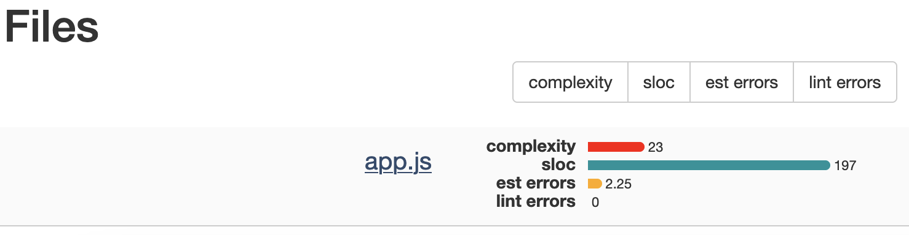
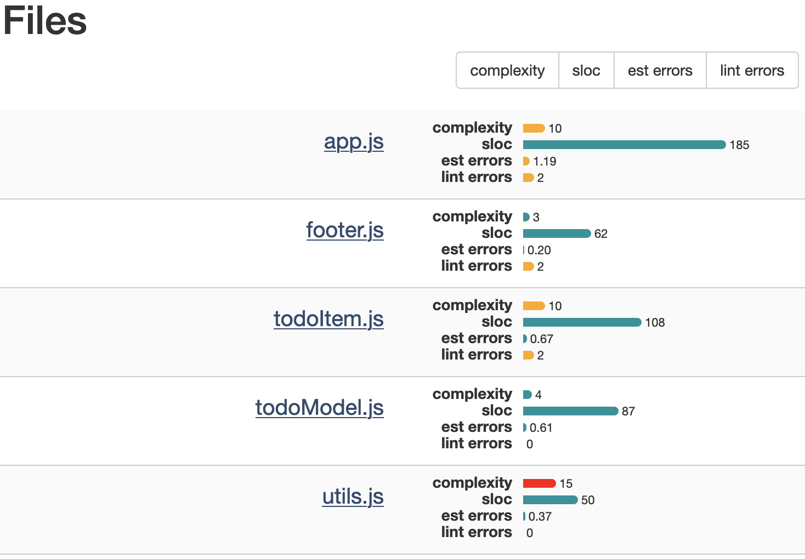

# React vs jQuery татаалдыгын өлчөө

## Өлчөп эмне кылабыз?

Мындай суроо кээде чыгып калат экен: "эмне үчүн долбоорду jQuery'ден React'ка өткөздүң эле?". Жаңы мүмкүнчүлүктөрдү кошуу оңой болсун дейбиз, бирок оңойлугун же татаалдыгын кантип өлчөбүз?

## Цикломатикалык татаалдык
React менен jQuery экөө асман менен жердей экени тажрыйбалуу адам үчүн анык эле нерседей. Бирок техникалык билими жок адамга аны кантип далилдейбиз?
Атайын метрикаларды колдонсок болот экен. Алардын бири -- [Cyclomatic Complexity](https://www.geeksforgeeks.org/cyclomatic-complexity/).
Коддун кандайдыр бир бөлүгүнүн цикломатикалык татаалдыгы -- андагы сызыктык көз карандысыз саптардын санын көрсөткөн өлчөм. Ал программанын татаалдыгын көрсөтөт, жана анын башкаруу агымынын (Control Flow) графын колдонуп эсептелет.
Графтын чокулары -- программанын командаларынын эң кичине тобу. Алар багытталган кырлар менен бириктирилет. Башкача айтанда, экинчи команда биринчиден кийин дароо кетерин көрсөтөт.
Мисалы, коддо башкаруу агымы жок болсо, анда анын цикломатикалык татаалдыгы 1 болот. Ал эми анда бир `if` шарты бар болсо, анда цикломатикалык татаалдыгы 2 болот, анткени анда эки жол болуп калат: бири `true`, экинчиси `false` жолу.

### Цикломатикалык татаалдыктын формуласы
Цикломатикалык татаалдыктын формуласы: `M = E - N + 2P`. Мында:
M = цикломатикалык татаалдык;
E = башкаруу агымдагы кырлардын саны;
N = башкаруу агымдагы чокулардын саны;
P = бири-бирине байланышкан компоненттердин саны.

## Изилдөө
Эми иш жүзүндө өлчөөгө убакыт келди.

### Аспап
Цикломатикалык татаалдыкты [plato](https://github.com/es-analysis/plato) деген аспап менен өлчөйбүз. Андыктан, аны `npm install -g plato` деп орнотуп алабыз.

### Салыштырылуучу код
Көрсөткүчтөр калыс болуусу зарыл. Андыктан биз бирдей эле функционал аткарган, бирок эки башка китепкана (library/библиотека) колдонуп жазылган долбоор табышыбыз керек.
Бактыбызга жараша [TodoMVC](https://todomvc.com/) деген долбоордо бир нече тил/технология менен жазылган мисалдар бар экен.
[Репозиторийинен](https://github.com/tastejs/todomvc) долбоорду көчүрүп алып, `examples` папкасына өтөбүз.

### jQuery боюнча көрсөткүчтөрдү алуу
`examples` папкасында туруп, `cd jquery/js` деп негизги код жайгашкан жерге келебиз.
Анан Plato'ну мындайча жүргүзөбүз: `plato -d result app.js -t jQuery -n`. Көрсөткүчтөр эми `result` папкасында. Ал жерде жаткан `index.html` файлын браузер менен ачабыз.

### React боюнча көрсөткүчтөрдү алуу
`examples` папкасында туруп, `cd react/js` деп негизги код жайгашкан жерге келебиз. Ал жердеги `*.jsx` файлдардын аталыштарын `.*js` кылып аташ керек болот, анткени `plato` `*.jsx` файлдарды көрбөй калышы мүмкүн.
Анан Plato'ну мындайча жүргүзөбүз: `plato -d result app.js footer.js todoItem.js todoModel.js utils.js -t react -n `. Көрсөткүчтөр эми `result` папкасында. Ал жерде жаткан `index.html` файлын браузер менен ачабыз.

### Натыйжа

#### jQuery
jQuery код бир гана `app.js` деген модулду камтыйт, ошондуктан репорттун `complexity`син карайбыз.

Цикломатикалык татаалдыгы 23 болду.

#### React
React'та `app.js, footer.js, todoItem.js, todoModel.js, utils.js` модулдар колдонулган. Алардын `complexity` көрсөткүчтөрүн алып, орто эсебин чыгарабыз.

(10 + 3 + 10 + 4 + 15) / 5 = 8.4
Ошентип, цикломатикалык татаалдыгы 8.4 болду.

#### Корутунду
jQuery менен жазылган код React менен жазылганга салыштырмалуу 173.8% татаал болуп чыкты.

PS
Айрымасы мындайча эсептелди:  |8.4 - 23|/8.4 = 14.6/8.4 = 1.7380952380952 = 173.80952380952%